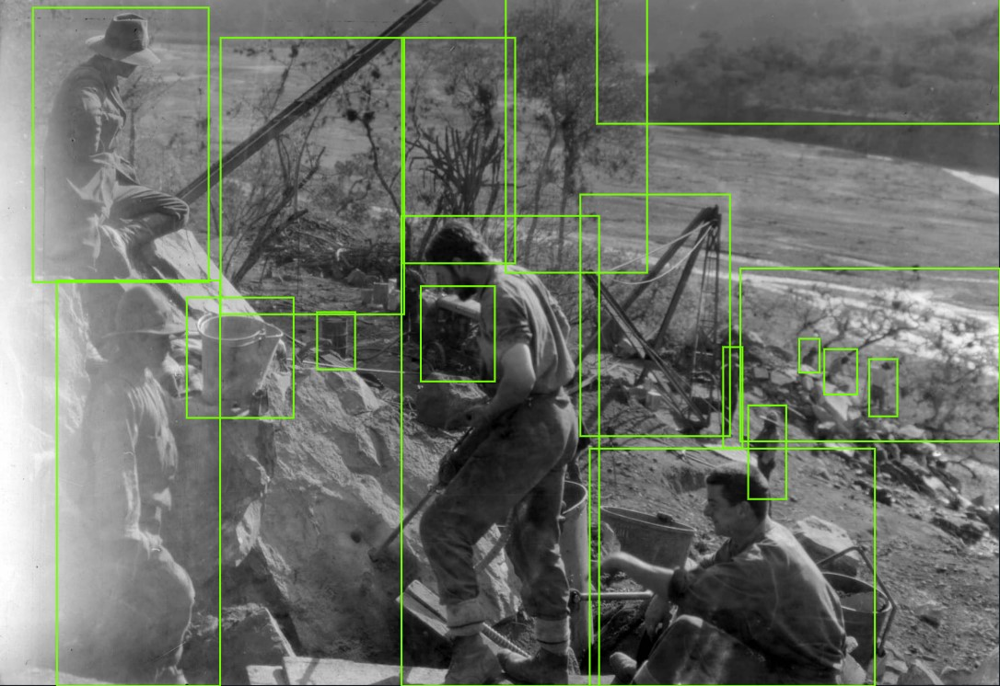

# The ROGER project: Robert Gerstmann's Repository

## Description

**The ROGER Project**: Implementation of a method for exploration, pre-classification, and semi-automatic narration of heritage archive images to augment the historical knowledge of an event through the use of convolutional neural networks and natural language processing.

## Team Members

- [**Dr. Brian Keith**](https://www.researchgate.net/profile/Brian-Keith-Norambuena), [Departamento de Ingeniería de Sistemas y Computación](http://www.disc.ucn.cl), [Universidad Católica del Norte](http://wwww.ucn.cl), Antofagasta, Chile.
- **Mg. Mauricio Matus**, [Escuela de Periodimo](https://www.periodismoucn.cl/), [Universidad Católica del Norte](http://wwww.ucn.cl), Antofagasta, Chile.
- **Dr. Claudio Meneses**, [Departamento de Ingeniería de Sistemas y Computación](http://www.disc.ucn.cl), [Universidad Católica del Norte](http://wwww.ucn.cl), Antofagasta, Chile.
- [**Mg. Diego Urrutia-Astorga**](https://www.researchgate.net/profile/Diego-Urrutia-Astorga), [Departamento de Ingeniería de Sistemas y Computación](http://www.disc.ucn.cl), [Universidad Católica del Norte](http://wwww.ucn.cl), Antofagasta, Chile.

## License

 This project is open-sourced software licensed under the [MIT license](LICENSE.md).
